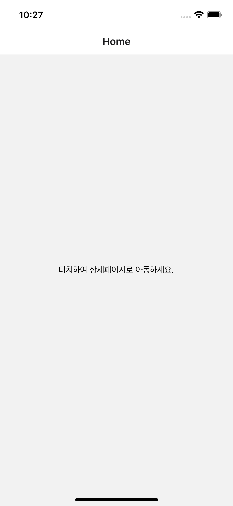
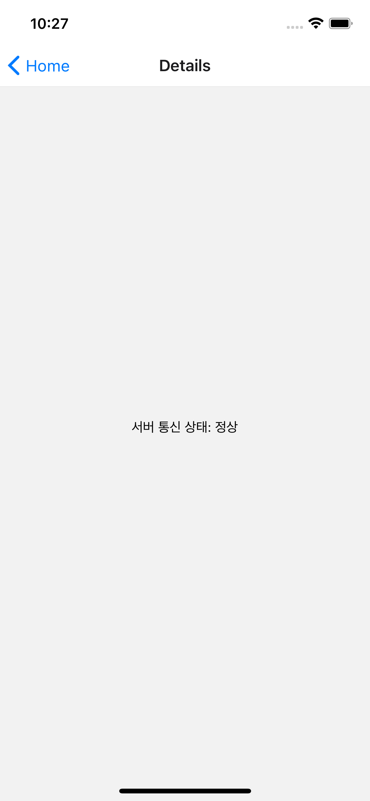
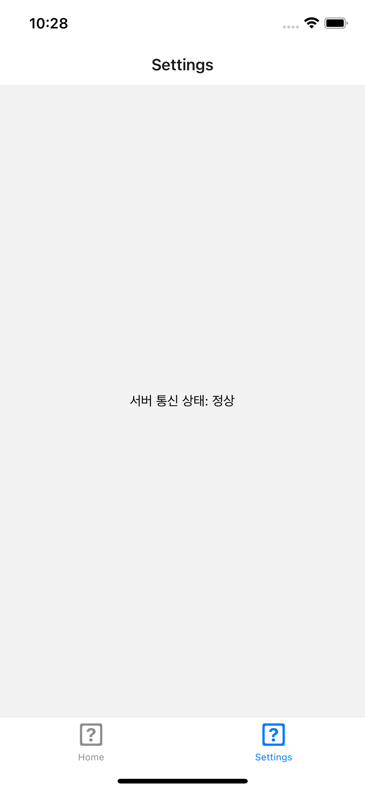

# bouncecode-react-native

[BounceCode CMS](https://github.com/bouncecode/bouncecode-cms) 와 함께 사용할 수 있습니다.

## 설치된 라이브러리

`react-native-splash-screen`: 스플래시 이미지를 변경하는 라이브러리

`react-native-orientation-locker`: 화면 회전을 고정할 수 있는 라이브러리

## 사용법

```sh
npx react-native init MyApp --template https://github.com/bouncecode/bouncecode-react-native.git
```

## Apple Silicon (M1) 대응

애플 실리콘 칩에서는 iOS 앱이 실행되지 않는 버그가 있습니다.

`응용 프로그램`에서 `Xcode` 를 오른쪽 클릭해서 `정보 가져오기`를 누르고, `Rosetta를 사용하여 열기`를 체크한 후 `Xcode`를 실행하세요.

터미널에서 실행할 때에는 `arch -x86_64 yarn ios` 를 이용하세요.

## 설정

### react-native-splash-screen

스플래시는 [react-native-splash-screen](https://github.com/crazycodeboy/react-native-splash-screen) 라이브러리를 사용하였습니다.

#### Android

스플래시 이미지 경로의 파일을 수정하세요.

```
android/app/src/main/res/drawable/launch_screen.png
```

#### iOS

스플래시 이미지 경로의 파일을 수정하세요.

```
ios/PROJECT_NAME/Images.xcassets/LaunchScreen.imageset/launch_screen.png
```

## 스크린샷






